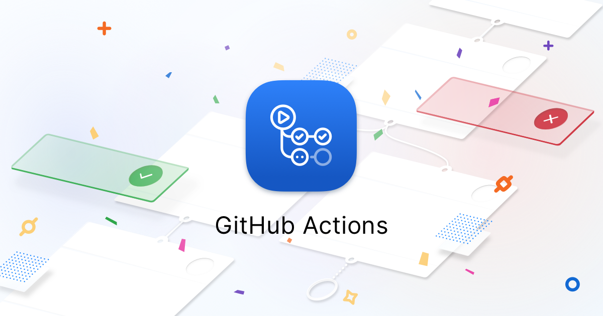
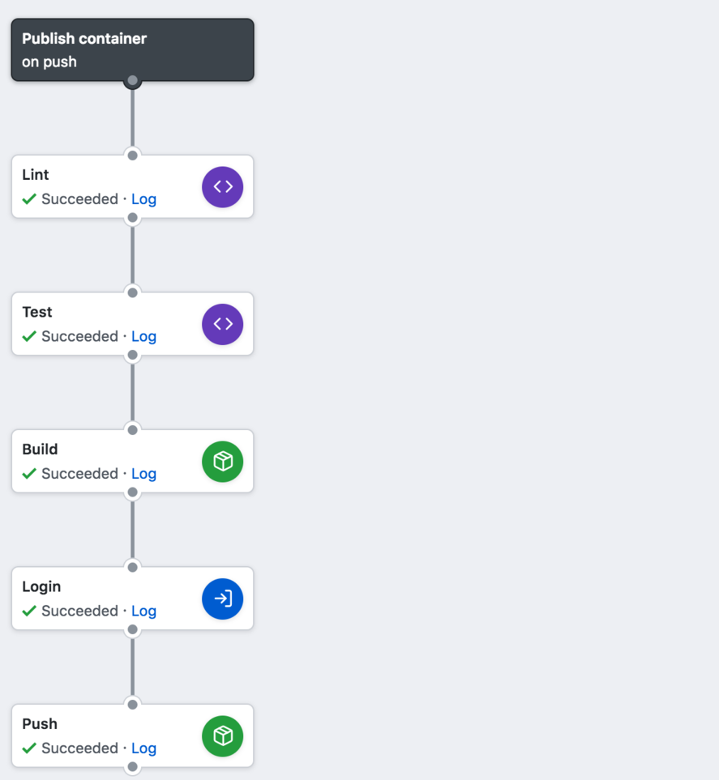
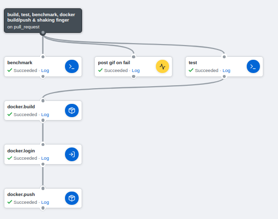
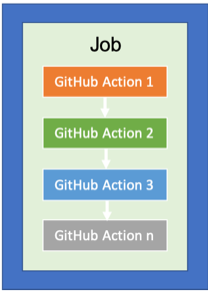
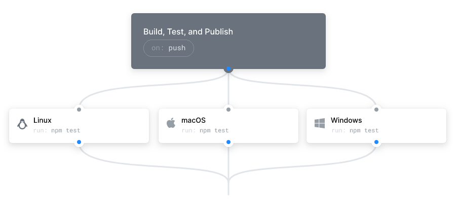
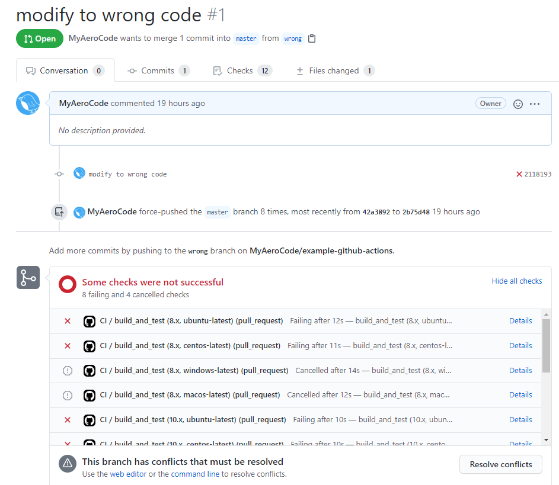
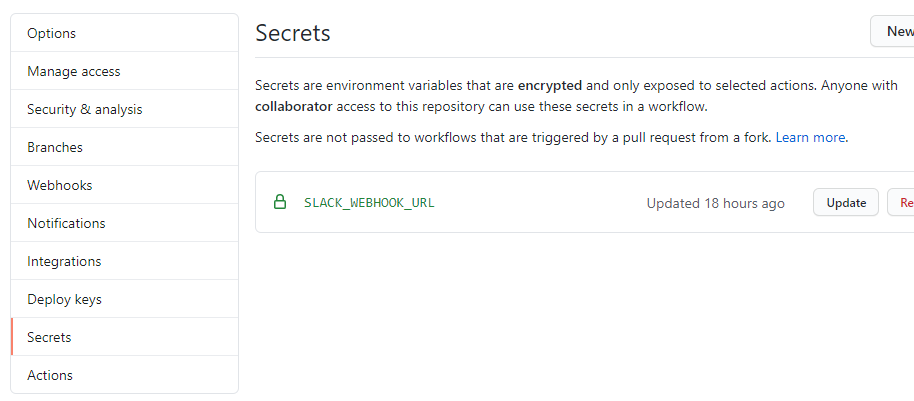
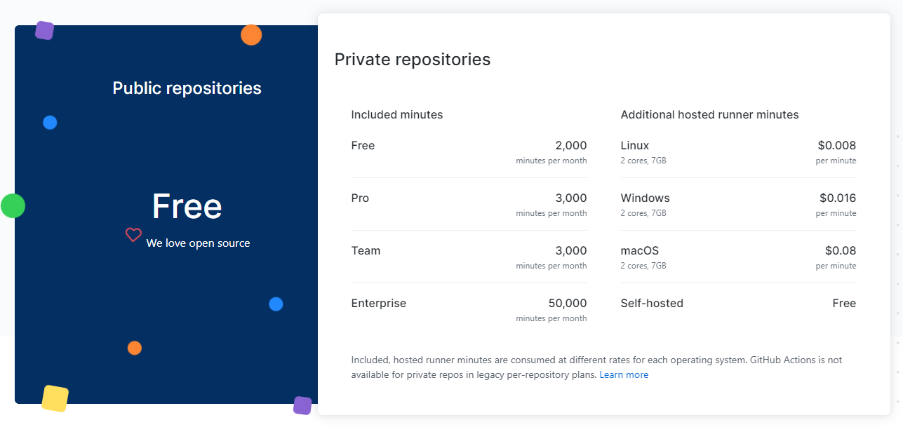
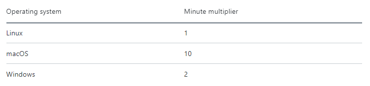
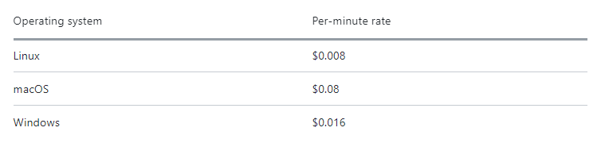

> # 깃허브 액션이란?

## 요약

`깃허브 액션(Github Actions)`은 일종의 훅 서비스입니다. 특정 레포지터리(또는 브랜치)에 `푸시` 또는 `풀 리퀘스트`와 같은 특별한 이벤트가 발생하면 `미리 작성된 워크플로우`를 도커 컨테이너에서 실행시킬 수 있습니다.

<br/>

## 실행단위

액션을 구성하는 요소들을 위에서부터 훑어보겠습니다.

<br/>

### 워크플로우 (Workflow)

가장 최상층에 위치한 개념이며, 모든 명령어의 흐름을 통틀어서 `워크플로우`라고 합니다. `특정 이벤트가 발생하면 명령어의 흐름(워크플로우)이 실행된다`라고 이해하시면 됩니다. 아래의 사진 하나가 단일 워크플로우입니다.



<br/>

`특정 이벤트가 발생`해야 워크플로우가 실행된다는 사실을 떠올려보면, 감지할 이벤트의 목록은 워크플로우의 속성이라는 것을 알 수 있습니다. 즉, `감지할 이벤트의 목록은 워크플로우 단계에서 설정`해야 합니다.

<br/>

### 작업 (Job)

작업이란 워크플로우에서 노드로 표현되는 각각의 단계입니다. 앞서 보았던 사진에서 `Lint`, `Test`, `Build`, `Login`, `Push`가 작업에 해당됩니다.

<br/>

서로다른 두 개의 작업은 `선행관계`를 지정할 수 있으며, 후행작업은 선행작업이 끝난 이후에야 실행될 수 있습니다. 만약 `선행관계가 설정되지 않은 경우 병렬로 실행`됩니다. 그리고 각각의 작업은 실패할 수 있으며, 선행작업이 실패한 경우 후행작업은 취소됩니다.



<br/>

### 액션 (Action, Step)

가장 작은 실행단위로 `컨테이너에서 실제 실행시킬 명령`을 의미하며 `여러개의 액션이 모여 하나의 작업을 구성`합니다. 아래 그림에 표현되어 있듯이 `하나의 작업 내에서 액션들은 항상 선행관계가 존재`하며 선행액션이 실패한 경우 후행액션은 취소되고, 덧붙여서 해당 작업은 실패됩니다. `스텝(Step)`으로 불리기도 합니다.



액션을 구체적으로 살펴보자면, 단일 액션은 다음 중 하나입니다.

1. `단일 스크립트 명령어`
2. `다중 스크립트 명령어`
3. `다른 사람이 배포한 액션 명령어`

<br/>

가장 눈에띄는 것은 `다른 사람이 배포한 액션 명령어`입니다. 이것은 액션이 `재사용 가능한 실행단위`라는 것을 의미하며, 자신이 작성한 액션을 타인에게 배포할 수도 있습니다.

<br/>

## 실행환경

### 명시해야 할 것

앞서 설명했듯이 `깃허브 액션은 도커 컨테이너 위에서 작동`한다고 했습니다만, 구체적으로는 `가상기계`와 `도커`의 2단계로 나누어집니다. 즉 `도커 이미지가 가상기계 위에서 수행`되는 형태이므로 2개의 실행환경을 명시해야 합니다.

-   `가상기계 운영체제` - 필수
-   `깃허브 액션에서 제공하는 도커 이미지 (또는 이미지의 목록)` - 선택

<br/>

도커 이미지는 선택사항이므로 `도커 이미지를 사용하지 않는다면 가상기계 운영체제에서 실행`되므로 문제는 아닙니다. 그러나 도커 이미지를 사용하는 경우에는 `호스트 운영체제는 있으나 마나 아닌가요?` 라고 생각할 수 있습니다.

<br/>

실제로 이 경우에서 호스트 운영체제는 중요하지 않지만, 그럼에도 불구하고 `호스트 운영체제는 필수값`입니다. 자세한 것은 [여기](https://github.community/t/confused-with-runs-on-and-container-options/16258)를 참조해주세요.

<br/>

### Job마다 실행환경이 다르다

제목과 같이 `작업마다 실행환경이 다르다`는 것에 주의해야 합니다. 각각의 작업은 자신만의 고유한 실행환경에서 실행되므로, 같은 컨테이너를 사용해야 하는 일련의 작업들은 `step`에 정의해야 합니다.

<br/>

그리고 `도커 이미지`는 여러개가 주어질 수 있다고 설명했습니다. 이 경우에는 `N개의 도커 이미지`를 생성하여 하나의 작업을 수행시킵니다. 이것을 활용하여 서로다른 운영체제에서의 작업을 실행시킬 수 있습니다.



<br/>

## 이벤트 목록

아래는 자주 사용하는 이벤트입니다.

-   on `push`
-   on `pull_request`

<br/>

일부 이벤트에는 하위타입이 존재할 수 있습니다.

-   on `issues`
    -   type : `opened` → 이슈가 새롭게 열린 경우
    -   type : `edited` → 이슈가 수정된 경우
    -   type : `closed` → 이슈가 닫힌 경우
    -   ...

<br/>

이외의 이벤트 목록은 [공식 도큐먼트](https://docs.github.com/en/actions/reference/events-that-trigger-workflows)를 참조해주세요.

<br/>

# 워크플로우 작성

위에서 설명했던 사항들을 `.github/workflows/xxx.yml`으로 저장해야 합니다. 천천히 따라가보세요.

<br/>

## 워크플로우

### 이름 설정

`name:`에는 워크플로우의 이름을 적을 수 있습니다. 워크플로우의 이름은 공백이 허용되지 않음에 유의해주세요. `-` 또는 `_`을 사용하는 것이 좋습니다.

```yml
#
# 워크플로우의 이름입니다.
name: Hello_CI
```

<br/>

### 트리거 설정

`on:`에는 감지할 이벤트를 적습니다. 여러개를 사용할 수 있습니다.

```yml
---
#
# 워크플로우가 트리거될 조건을 설정합니다.
on:
    push:
    pull_request:
```

### (옵션) 브랜치 범위 제한

각 이벤트 하위에 `branches:`를 사용하여 감지할 브랜치의 범위를 좁힐 수 있습니다.

```yml
---
#
# 워크플로우가 트리거될 조건을 설정합니다.
on:
    push:
        branches:
            # 단일 브랜치
            - master

            # 다중 브랜치
            - [master, dev]

            # * 또는 ** 정규식 매칭
            # refs/heads/releases/ 하위의 브랜치에 적용됩니다.
            - "releases/**"

    pull_request:
```

`branches-ignore`를 위처럼 사용하면 특정 브랜치를 제외할 수 있습니다.

<br/>

### (옵션) 태그 범위 제한

각 이벤트 하위에 `tag:`를 사용하여 감지할 태그의 범위를 좁힐 수 있습니다.

```yml
---
#
# 워크플로우가 트리거될 조건을 설정합니다.
on:
    push:
        tags:
            # 단일 태그
            - v1

            # 다중 태그
            - [v1, v2]

            # * 또는 ** 정규식 매칭
            # v1.1, v1.2 ... v1.9 까지 매칭됩니다.
            - v1.*

    pull_request:
```

`tags-ignore`를 위처럼 사용하면 특정 브랜치를 제외할 수 있습니다.

<br/>

### (옵션) 크론식을 이용한 반복

`schedule:`와 크론식을 사용하여 특정 간격으로 워크플로우를 실행시킬 수 있습니다.

```yml
---
on:
    schedule:
        - cron: "*/15 * * * *"
```

<br/>

## 작업

작업은 여러개가 기술될 수 있으며 `jobs:`에서 시작합니다.

```yml
---
jobs:
    #
    # 작업 식별자가 build_and_test인 작업을 생성합니다.
    build_and_test:

    #
    # 작업 식별자가 nofity_to_slack인 작업을 생성합니다.
    notify_to_slack:
```

<br/>

### 호스트 운영체제 명세

`runs-on:`을 사용하여 호스트 운영체제를 명세할 수 있습니다. `도커 이미지`가 명세되어 있지 않다면 액션들은 호스트 운영체제에서 실행됩니다. `도커 이미지`가 명세되어 있다면 도커 이미지에서 액션들이 실행되므로 아무 운영체제나 적어도 됩니다.

```yml
---
jobs:
    build_and_test:
        runs-on: ubuntu-latest
```

**지원하는 운영체제 목록 :**

-   `windows-latest` or `windows-2019`
-   `centos-latest`
-   `ubuntu-20.04`
-   `ubuntu-latest` or `ubuntu-18.04`
-   `ubuntu-16.04`
-   `macos-latest` or `macos-10.15`

<br/>

### (옵션) 도커 이미지 명세

`strategy:`와 `matrix:`를 사용하면 간단하게 도커 이미지를 명세할 수 있습니다. 아래는 4개의 운영체제에서 각각 `8, 10, 12` 버전의 노드를 이용한 실행환경을 생성합니다. 즉, 12개의 실행환경이 만들어집니다.

```yml
---
jobs:
    build_and_test:
        runs-on: ubuntu-latest
        strategy:
            matrix:
                node-version: [8.x, 10.x, 12.x]
                container:
                    [
                        "ubuntu-latest",
                        "centos-latest",
                        "windows-latest",
                        "macos-latest",
                    ]
```

<br/>

커스텀 도커 이미지를 사용하고 싶다면 `matrix:`를 사용하면 안됩니다.

```yml
---
jobs:
    build_and_test:
        runs-on: ubuntu-latest
        strategy:
            container:
                image: node:10.16-jessie
                env:
                    NODE_ENV: development
                ports:
                    - 80
                volumes:
                    - my_docker_volume:/volume_mount
                options: --cpus 1
```

<br/>

### (옵션) 선행관계 설정

후행작업에서 `needs:`를 사용하면 해당 작업들이 끝날때까지 대기합니다. 즉, 아래의 작업들은 `1 → 2 → 3` 순서로 수행됩니다.

```yml
---
jobs:
    job1: ....
    job2:
        needs: job1
    job3:
        needs: [job1, job2]
```

만약 아래와 같이 선행관계를 지정하지 않았다면 병렬로 실행되므로, 작업간의 실행순서를 보장할 수 없습니다.

```yml
---
jobs:
    job1:
    job2:
    job3:
```

<br/>

### (옵션) 환경변수 설정

일부 작업에서 환경변수를 사용한다면 `env:`에서 설정할 수 있습니다.

```yml
jobs:
    build_and_test:
       ...
       env:
           ENV_KEY1: xxx
           ENV_KEY2: xxx
```

<br/>

### (옵션) 선택적 실행 설정

`if:`에 넣어진 표현식의 결과가 참이 아니라면 수행되지 않습니다. 예를 들어, 아래의 워크플로우에서 슬랙 알림은 `푸시 이벤트의 경우에만 실행`됩니다.

```yml
---
on:
    push:
    pull_request:

jobs:
    nofity_to_slack:
        if: github.event_name == 'push'
```

표현식에 대한 설명은 [공식 도큐먼트](https://docs.github.com/en/actions/reference/context-and-expression-syntax-for-github-actions)를 참조해주세요.

<br/>

## 액션

워크플로우 작성시에는 `스텝`이라는 용어를 사용합니다. 각 작업의 `steps:`에 적으며, 새로운 스텝마다 `-`를 앞에 적어야 합니다.

```yml
...
jobs:
    build_and_test:
        ...
        steps:
           - action1:
           - action2:
           ...
           - actionN:
```

앞선 설명에서 스텝은 다음 중 하나임을 상기해주세요.

1. 단일 스크립트
2. 다중 스크립트
3. 다른 사람이 배포한 액션

<br/>

### 단일 스크립트

`run:`에 실행할 스크립트를 적습니다.

```yml
...
jobs:
    build_and_test:
        ...
        steps:
          - name: Execute test.
            run: npm test
```

<br/>

### 다중 스크립트

`run:`에 `|`으로 시작하여 적고싶은 만큼 적습니다.

```yml
...
jobs:
    build_and_test:
        ...
        steps:
          - name: Execute test.
            run: npm test

          - name: Install dependencies.
            run: |
              npm cl
              npm install
```

<br/>

### 다른 사람이 배포한 스크립트

`use:`를 사용하면 됩니다. 필요한 경우 `with:`과 `env:`를 사용하여 추가적인 데이터를 보낼 수 있습니다.

```yml
...
jobs:
    notify_to_slack:
        ...
        steps:
          - use: 8398a7/action-slack@v3
            with:
                ...
            env:
                ...
```

<br/>

> # CI/CD

## 지속적 통합 (CI)

하나의 레포지터리에 `여러명이 동시에 커밋`을 날리는 일은 드물지 않습니다. 여러명이 개발을 하는 도중에 코드가 손상되는 경우도 있겠죠. 이것을 방지하기 위해 대부분 `개발용 브랜치를 마스터에 병합하기 전에 코드 테스트를 수행하여 검사`하는 방식을 사용합니다.

<br/>

이것을 구현하는 방법은 생각보다 간단합니다 `마스터 브랜치에 pull_request를 날렸을 때 테스트 코드를 수행`하도록 깃허브 액션을 설정하면 됩니다. 실제 워크플로우 파일은 다음과 같습니다.

```yml
#
# 워크플로우의 이름입니다.
name: Hello_CI

#
# master에 pull_request가 발생할 경우에 워크플로우를 실행합니다.
on:
    pull_request:
        branches: [master]

jobs:
    #
    # build_and_test을 이름으로 갖는 작업을 정의합니다.
    build_and_test:
        runs-on: ubuntu-latest
        strategy:
            matrix:
                node-version: [8.x, 10.x, 12.x]
                container:
                    [
                        "ubuntu-latest",
                        "centos-latest",
                        "windows-latest",
                        "macos-latest",
                    ]

        steps:
            #
            # 프로젝트의 루트(`$GITHUB_WORKSPACE`)로 이동합니다.
            - uses: actions/checkout@v2

            #
            # 프로젝트에 필요한 의존성을 설치합니다.
            - name: Install dependencies.
              run: |
                  npm ci
                  npm install

            #
            # 테스트를 실행합니다.
            - name: Execute test.
              run: npm test
```

이제 `풀 리퀘스트`가 발생하면, 워크플로우에서 실행했던 테스트 결과가 함께 표시됩니다. 아래는 테스트를 통과하지 못한 코드를 `풀 리퀘스트`했을 때의 스크린샷입니다.



<br/>

## 지속적 배포 (CD)

마스터에 새로운 코드가 푸시되면 `바뀐 코드를 서버에 배포`해야 합니다. 이것을 매번 사람이 하기에는 번거로우므로 `마스터에 코드가 푸시되면 서버에 배포하도록` 깃허브 액션을 설정하면 됩니다. 물론 `테스트`가 먼저 이루어져야 합니다.

<br/>

여기서는 서버에 배포하는 것 대신에 `슬랙 메세지 알림`으로 대체하겠습니다.

```yml
name: Hello_CI

on:
    push:
        branches: [master]
    pull_request:
        branches: [master]

jobs:
    build_and_test:
        runs-on: ubuntu-latest
        strategy:
            matrix:
                node-version: [8.x, 10.x, 12.x]
                container:
                    [
                        "ubuntu-latest",
                        "centos-latest",
                        "windows-latest",
                        "macos-latest",
                    ]
        steps:
            - uses: actions/checkout@v2

            - name: Install dependencies.
              run: |
                  npm ci
                  npm install

            - name: Execute test.
              run: npm test

    alert_to_slack:
        runs-on: ubuntu-latest

        #
        # push로 발생한 경우에만 해당 작업을 실행합니다.
        # 즉, pull_request로 발생했다면 아래 작업은 실행되지 않습니다.
        if: github.event_name == 'push'

        #
        # build_and_test가 성공한 뒤에 실행됩니다.
        needs: build_and_test

        steps:
            - uses: 8398a7/action-slack@v3
              with:
                  status: custom
                  fields: workflow,job,commit,repo,ref,author,took
                  custom_payload: |
                      {
                          username: 'action-slack',
                          icon_emoji: ':robot_face:',
                          attachments: [{
                              color: '${{ job.status }}' === 'success' ? 'good' : '${{ job.status }}' === 'failure' ? 'danger' : 'warning',
                              text: `${process.env.AS_WORKFLOW}\n${process.env.AS_JOB} (${process.env.AS_COMMIT}) of ${process.env.AS_REPO}@master by ${process.env.AS_AUTHOR} succeeded in ${process.env.AS_TOOK}`,
                          }]
                      }

              #
              # 레포지터리에 secrets으로 설정된 키-값을 가져올 수 있습니다.
              env:
                  SLACK_WEBHOOK_URL: ${{ secrets.SLACK_WEBHOOK_URL }}
```

위의 파일의 맨 마지막 줄에 주목해주세요. 슬랙에 메세지를 보내기 위해 `웹 훅 URL`이 사용된 것 처럼 민감한 정보가 요구될 수 있습니다. 이 때, 워크플로우 파일에 직접 적는 것은 위험한 행동입니다. 레포지터리에 `시크릿`을 생성하세요.



이렇게 생성된 시크릿은 워크플로우 파일에서 다음과 같이 사용할 수 있습니다.

```yml
${{ secrets.YOUR_SECRET_NAME }}
```

<br/>

# 과금



## 공개 레포지터리

`Public Repo`는 오픈소스로 취급하므로 완전 무료입니다.

<br/>

## 비공개 레포지터리

`Private Repo`는 일정량만 무료이며 초과시 과금이 부과됩니다. 무료 계정에 대해서는 `매월 2000분`이 무료로 제공되며, 실행된 시간만큼 무료 제공량에서 깎입니다. 주의해야 할 것은 운영체제에 따라 `시간이 n배 더 많이 깎일 수 있습니다`.



예를 들어,

-   리눅스를 100분간 사용했다면 1배 증량한 `100분`이 사용됩니다.
-   윈도우를 100분간 사용했다면 2배 증량한 `200분`이 사용됩니다.
-   매킨토시를 100분간 사용했다면 10배 증량한 `1,000분`이 사용됩니다.

<br/>

분당 과금되는 비용은 다음과 같습니다.



<br/>

각 계정의 최대 과금량의 초기값은 0이며, 무료 사용량을 넘어서면 액션은 더 이상 트리거되지 않습니다.

<br/>

# 샘플 레포지터리 보기

해당 포스팅에 사용된 레포지터리는 [여기](https://github.com/MyAeroCode/example-github-actions)에서 확인할 수 있습니다.
